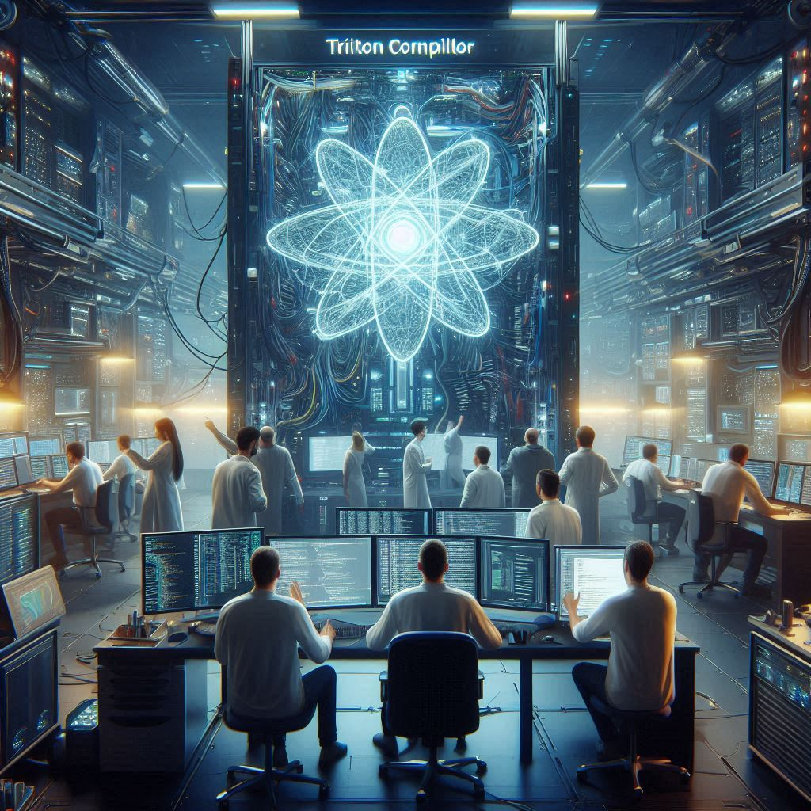
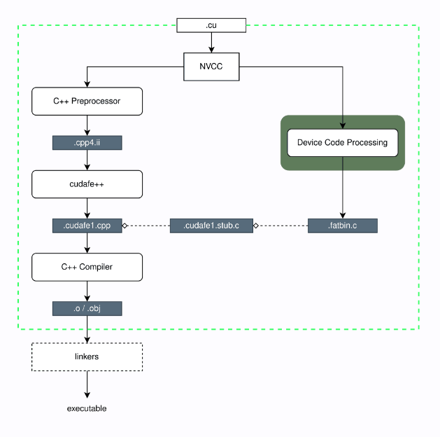
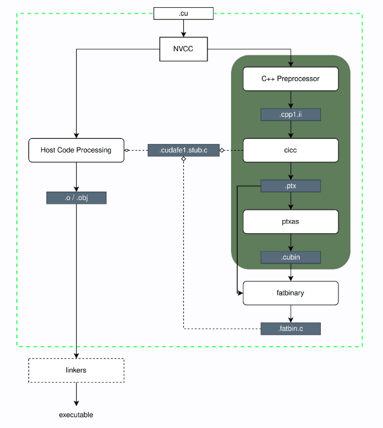
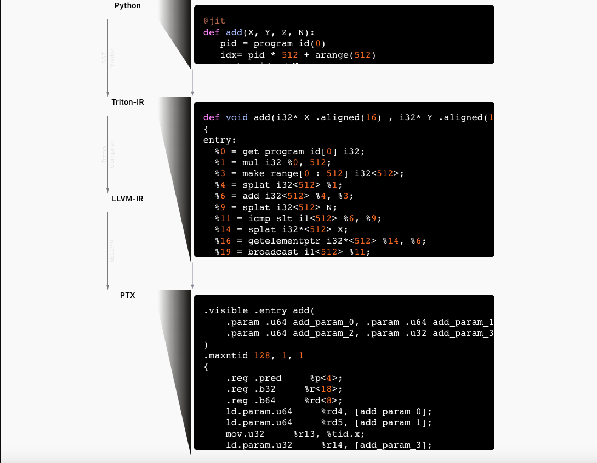
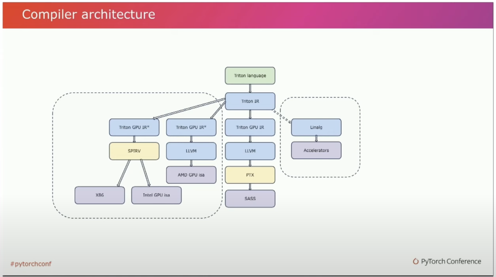

# Triton Internals

<style scoped>
section {
  font-size: 28px;
}
</style>

How Triton compiler works under the hood!

</br>

Kapil Sharma
Software Engineer @ Meta

---

## About Me

- Work on RecSys/Ranking focussed Infra
- Discord: @sk4301
- Linkedin: https://www.linkedin.com/in/sharma-k/
- Twitter: @kapil_sh_
- Github: https://github.com/kapilsh

---

## About this talk
- GPU Mode Previous Talks on Triton (Triton 101, Fusing Kernels, Liger Kernels)
- Researchers love triton
- Research ➡️ Production 📈📈📈
- What is Triton? Complex compiler/codegen machinery underneath 
- Pytorch ➡️ torch.compile ➡️ triton kernels ➡️ target hardware
- Blog posts: [Part 1](https://www.kapilsharma.dev/posts/deep-dive-into-triton-internals/), [Part 2](https://www.kapilsharma.dev/posts/deep-dive-into-triton-internals-2/), [Part 3](https://www.kapilsharma.dev/posts/deep-dive-into-triton-internals-3/)


---
## Agenda



- [Cuda Compilation](#5)
- [Triton Compilation](#9)
- [Example](#11)
- [Jit Compilation](#15)
- [Triton and MLIR](#16)
- [IR Walkthrough](#23)
- [Example MLIR Pass](#29)
- [If Time Permits: Add a new compiler pass](#31)

---

# CUDA Compilation

----

<style scoped>
section {
  font-size: 25px;
}
</style>



## NVCC toolchain

- NVCC separates the host code (C/C++ code) from device code (CUDA kernels)
- Host code is compiled using a standard C/C++ compiler
- Device code is compiled into PTX/cubin
- Uses external C++ compilers like g++ or clang for host compilation
- NVCC compiles .cu files for GPU execution and .cpp files for host code.

----


----

## Device Code Processing

<style scoped>
section {
  font-size: 22px;
}
</style>



- The NVCC compiler processes device code in two key phases
- The first phase generates intermediate forms using the C++ preprocessor and `cicc` program
- The `cicc` program optimizes and generates PTX
- The PTX code is then passed to `ptxas`, which produces `SASS`
- [Godbolt Example](https://godbolt.org/z/GcYKT7cfo)

----



## Triton Compilation

- Triton compiler takes the DSL code and compiles it over multiple stages down to CUBIN/fatbinary
- Generated executable CUBIN is loaded inline in cuda kernel
    - [ELF-formatted file](https://docs.nvidia.com/cuda/cuda-binary-utilities/index.html#what-is-a-cuda-binary) which consists of CUDA executable code 


----

<!--
footer: Source: https://www.youtube.com/watch?v=AtbnRIzpwho
-->





----

<!--
footer: ''
-->

## Example: add_kernel

```python
@triton.jit
def add_kernel(x_ptr,
               y_ptr,
               output_ptr,
               n_elements,
               BLOCK_SIZE: tl.constexpr,
               ):
    pid = tl.program_id(axis=0)  # We use a 1D launch grid so axis is 0.
    block_start = pid * BLOCK_SIZE
    offsets = block_start + tl.arange(0, BLOCK_SIZE)
    mask = offsets < n_elements
    x = tl.load(x_ptr + offsets, mask=mask)
    y = tl.load(y_ptr + offsets, mask=mask)
    output = x + y
    tl.store(output_ptr + offsets, output, mask=mask)
```

```shell
$ # clone triton repo and install from source
$ # Dumps generated code to TRITON_CACHE_DIR=~/.triton/cache 
$ python3 ../../triton/python/triton/tools/compile.py \
  --kernel-name add_kernel \
  --signature "*fp32,*fp32,*fp32,i32,64" \
  --grid=1024,1024,1024 \
  vector_add.py

```
----

## Example : add_kernel

```shell
$ ll | grep add_kernel
-rw-rw-r--  1 ksharma ksharma  36K Aug  1 22:55 add_kernel.9969bdda_0123.c
-rw-rw-r--  1 ksharma ksharma  501 Aug  1 22:55 add_kernel.9969bdda_0123.h

$ ll ~/.triton/cache/z8LaDnJEt9PBQ6kqB-fckHL71-x-aUysRw-hpmbeuJc
total 36K
-rw-rw-r-- 1 ksharma ksharma 5.5K Sep 11 07:27 add_kernel.cubin
-rw-rw-r-- 1 ksharma ksharma  686 Sep 11 07:27 add_kernel.json
-rw-rw-r-- 1 ksharma ksharma 4.1K Sep 11 07:27 add_kernel.llir
-rw-rw-r-- 1 ksharma ksharma 3.0K Sep 11 07:27 add_kernel.ptx
-rw-rw-r-- 1 ksharma ksharma 3.5K Sep 11 07:27 add_kernel.ttgir
-rw-rw-r-- 1 ksharma ksharma 3.1K Sep 11 07:27 add_kernel.ttir
-rw-rw-r-- 1 ksharma ksharma  679 Sep 11 07:27 __grp__add_kernel.json
```

- This should dump a .c and .h file with the cuda kernel code.
- [add_kernel.9969bdda_0123.c](https://gist.github.com/kapilsh/23599d68a4e3e8af7ae46ccc670ed444)
- [add_kernel.9969bdda_0123.h](https://gist.github.com/kapilsh/16d1218c0629242bb7e9b613609129dd)

----

## Example: add_kernel (Artifacts)

- [Triton IR](https://gist.github.com/kapilsh/e8f09e8ed4f2f3bcfe13dd4bd099e270#file-add_kernel-ttir)
- [Triton GPU IR](https://gist.github.com/kapilsh/e8f09e8ed4f2f3bcfe13dd4bd099e270#file-add_kernel-ttgir)
- [LLVM IR](https://gist.github.com/kapilsh/e8f09e8ed4f2f3bcfe13dd4bd099e270#file-add_kernel-llir)
- [PTX](https://gist.github.com/kapilsh/e8f09e8ed4f2f3bcfe13dd4bd099e270#file-add_kernel-ptx)
- [CUBIN](https://gist.github.com/kapilsh/e8f09e8ed4f2f3bcfe13dd4bd099e270#file-add_kernel-cubin)
- Some tools
  - File is elf formatted: `readelf -a add_kernel.cubin`
  - `cuobjdump  add_kernel.cubin -sass -ptx` ([cuobjdump](https://docs.nvidia.com/cuda/cuda-binary-utilities/index.html#command-line-options))
  - `nvdisasm -gi  add_kernel.cubin` ([nvdisasm](https://docs.nvidia.com/cuda/cuda-binary-utilities/index.html#nvdisasm))
- More details on Python bindings in [Part 2](https://www.kapilsharma.dev/posts/deep-dive-into-triton-internals-2/) of blog series

----

## Example: add_kernel (JIT Compiled)

- Artifacts that are dumped on the disk can also be retrieved directly from the kernel

```python

size = 1024
x = torch.rand(size, device='cuda')
y = torch.rand(size, device='cuda')
grid = lambda meta: (triton.cdiv(size, meta['BLOCK_SIZE']),)

output = torch.empty_like(x)
compiled_kernel = add_kernel[grid](x, y, output, size, BLOCK_SIZE=1024)

# to get all the codegen keys
print(compiled_kernel.asm.keys())
# dict_keys(['llir', 'ttgir', 'ttir', 'ptx', 'cubin'])
```

----

## JIT Compiled Kernel :rocket:

- Several layers of code generation
    - Python DSL ➡️ IR ➡️ PTX ➡️ CUBIN/fatbinary ➡️ launcher.so
- Saves it on disk (`TRITON_CACHE_DIR`) through a [cache manager](https://github.com/triton-lang/triton/blob/4348109b0a8e1aac748aa9b1bbbcd858e9488940/python/triton/runtime/cache.py#L50-L71); loaded inline as fatbinary (cubin)
- Targetted hardware have respective drivers that provide native code wrapped as python modules
- Driver loads cubin into the CUDA driver. [Reference Code](https://github.com/triton-lang/triton/blob/main/third_party/nvidia/backend/driver.c#L389-L406)
- Exported shared libraries: [cuda_utils.so](https://github.com/triton-lang/triton/blob/main/third_party/nvidia/backend/driver.py#L72-L86) and [__triton_launcher.so](https://github.com/triton-lang/triton/blob/main/third_party/nvidia/backend/driver.py#L413-L426)
- Code pointers
    - [compile_module_from_src](https://github.com/triton-lang/triton/blob/main/third_party/nvidia/backend/driver.py#L48-L64)
    - [triton.runtime.build](https://github.com/triton-lang/triton/blob/main/python/triton/runtime/build.py#L21-L80)

----


----

## Triton :heart: MLIR

- [Complete rewrite of the backend from scratch](https://github.com/triton-lang/triton/pull/1004) in 2022
- MLIR is a flexible infrastructure for modern optimizing compilers; part of the LLVM ecosystem
- Consists of [Intermediate Representation (IR) specifications](https://mlir.llvm.org/docs/Passes/) and a toolkit for transformations
- Uses dialects that provide custom DSLs/IRs built on top of MLIR framework
    - Dialects are mechanism to engage with and extend the MLIR ecosystem
- Tensorflow was the first major ML framework using MLIR
    - [Good resource on MLIR applied to ML Frameworks](https://www.youtube.com/watch?v=R5LLIj8EMxw): Tensorflow but still useful
- All of Triton dialects use table-gen (DSL/codegen for MLIR boilerplate)
  - [Good Resource on tablegen](https://www.jeremykun.com/2023/08/10/mlir-using-tablegen-for-passes/)
- `MLIR_ENABLE_DUMP=1` to dump IR after each pass in triton
    - `MLIR_ENABLE_DUMP=1 python vector_add.py`


----

## MLIR Hello World Example

```
mlir::ModuleOp module = mlir::ModuleOp::create(mlir::UnknownLoc::get());
mlir::PassManager pm(module);

// Add some passes
pm.addPass(mlir::createCSEPass());
pm.addPass(mlir::createDeadCodeEliminationPass());

pm.run(module);
```

---

## MLIR Example

```python
def foo(b, c):
  a = b + c
  d = b + c # replace with a (CSE)
  e = 2 * a # noop (Dead code elimination)
  return d
```
⚒️ 🪚 🔧 🪛 

```python
def foo(b, c):
  a = b + c
  d = a
  return d
```

---

## Common Passes

- Several common passes are provided by MLIR and are directly used by triton
- Includes optimizations such CSE, DCE, etc.
- Ref: [MLIR Common Passes](https://mlir.llvm.org/doxygen/namespacemlir.html)

```cpp
void init_triton_passes_common(py::module &&m) {
  using namespace mlir;
  ADD_PASS_WRAPPER_0("add_sccp", createSCCPPass);
  ADD_PASS_WRAPPER_0("add_symbol_dce", createSymbolDCEPass);
  ADD_PASS_WRAPPER_0("add_inliner", createInlinerPass);
  ADD_PASS_WRAPPER_0("add_canonicalizer", createCanonicalizerPass);
  ADD_PASS_WRAPPER_0("add_cse", createCSEPass);
  ADD_PASS_WRAPPER_0("add_licm", createLoopInvariantCodeMotionPass);
}
```

----

## Triton Passes
- **TritonCombineOps:** 
    - `dot(a, b, 0) + c => dot(a, b, c)`
    - `addptr(addptr(ptr, idx0), idx1) => addptr(ptr, AddI(idx0, idx1))`
- **TritonReorderBroadcast:** Moves broadcast/splat after element-wise ops
    - `elementwise(broadcast(a)) => broadcast(elementwise(a))`
    - `elementwise(splat(a), splat(b), ...) => splat(elementwise(a, b, ...))`
- **TritonRewriteTensorPointer:** After this pass, `tt.make_tensor_ptr` and `tt.advance` will disappear
- **TritonLoopUnroll:** Unrolls  (Structured Control Flow) loop with `tt.loop_unroll_factor` attribute
- Reference table-gen: [Triton Passes](https://github.com/triton-lang/triton/blob/576426bccfb9a2c90f2abaa405995738d4a79403/include/triton/Dialect/Triton/Transforms/Passes.td#L27)


---

## Triton GPU Passes

```python
def make_ttgir(mod, metadata, opt, capability):
    ...truncated...
    # TTIR -> TTGIR
    pm = ir.pass_manager(mod.context)
    pm.enable_debug()
    ...truncated...
    nvidia.passes.ttnvgpuir.add_plan_cta(pm, cluster_info)
    passes.ttgpuir.add_remove_layout_conversions(pm)
    passes.ttgpuir.add_optimize_thread_locality(pm)
    passes.ttgpuir.add_accelerate_matmul(pm)
    passes.ttgpuir.add_remove_layout_conversions(pm)
    passes.ttgpuir.add_optimize_dot_operands(pm, capability >= 80)
    passes.common.add_cse(pm)
    if capability // 10 >= 8:
        passes.ttgpuir.add_combine_tensor_select_and_if(pm)
        passes.ttgpuir.add_pipeline(pm, opt.num_stages)
    ...truncated...
    pm.run(mod)
    return mod
```
Reference table-gen: [Triton GPU Passes](https://github.com/triton-lang/triton/blob/main/include/triton/Dialect/TritonGPU/Transforms/Passes.td), [Triton NVIDIA Passes](https://github.com/triton-lang/triton/blob/main/include/triton/Dialect/TritonNvidiaGPU/Transforms/Passes.td)


--- 

## Triton GPU Passes

- Triton compiler applies several gpu specific optimization passes to the IR previously generated. 
- Some of the well-known optimization passes include:
  - Coalescing
  - F32 dot product optimization
  - CTA planning
  - Thread locality
  - Matrix multiplication acceleration
  - Optimization of dot operands
  - Data de-duplication
  - Instructions reordering
  - TMA lowering, etc.

---

## IR Walkthrough: add_kernel ([gist](https://gist.github.com/kapilsh/cee55b221d7f91dc64fbac46f018163c))

```
#blocked = #triton_gpu.blocked<{
  sizePerThread = [4], threadsPerWarp = [32], warpsPerCTA = [4], order = [0]
}>
#loc = loc("/home/ksharma/dev/git/triton/python/tutorials/01-vector-add.py":28:0)
module attributes {
  "triton_gpu.num-ctas" = 1 : i32, 
  "triton_gpu.num-warps" = 4 : i32, 
  triton_gpu.target = "cuda:89", 
  "triton_gpu.threads-per-warp" = 32 : i32} {
      tt.func public @add_kernel(
        %arg0: !tt.ptr<f32> {tt.divisibility = 16 : i32} ..., 
        %arg1: !tt.ptr<f32> {tt.divisibility = 16 : i32} ..., 
        %arg2: !tt.ptr<f32> {tt.divisibility = 16 : i32} ..., 
        %arg3: i32 {tt.divisibility = 16 : i32} ...) attributes {noinline = false} {
    %c1024_i32 = arith.constant 1024 : i32 loc(#loc1)
    %0 = tt.get_program_id x : i32 loc(#loc2)
    %1 = arith.muli %0, %c1024_i32 : i32 loc(#loc3)
    %2 = tt.make_range {end = 1024 : i32, start = 0 : i32} : tensor<1024xi32, #blocked> loc(#loc4)
    %3 = tt.splat %1 : i32 -> tensor<1024xi32, #blocked> loc(#loc5)
    %4 = arith.addi %3, %2 : tensor<1024xi32, #blocked> loc(#loc5)
    %5 = tt.splat %arg3 : i32 -> tensor<1024xi32, #blocked> loc(#loc6)
    %6 = arith.cmpi slt, %4, %5 : tensor<1024xi32, #blocked> loc(#loc6)
    %7 = tt.splat %arg0 : !tt.ptr<f32> -> tensor<1024x!tt.ptr<f32>, #blocked> loc(#loc7)
    %8 = tt.addptr %7, %4 : tensor<1024x!tt.ptr<f32>, #blocked>, tensor<1024xi32, #blocked> loc(#loc7)
    %9 = tt.load %8, %6 : tensor<1024x!tt.ptr<f32>, #blocked> loc(#loc8)
    %10 = tt.splat %arg1 : !tt.ptr<f32> -> tensor<1024x!tt.ptr<f32>, #blocked> loc(#loc9)
    %11 = tt.addptr %10, %4 : tensor<1024x!tt.ptr<f32>, #blocked>, tensor<1024xi32, #blocked> loc(#loc9)
    %12 = tt.load %11, %6 : tensor<1024x!tt.ptr<f32>, #blocked> loc(#loc10)
    %13 = arith.addf %9, %12 : tensor<1024xf32, #blocked> loc(#loc11)
    %14 = tt.splat %arg2 : !tt.ptr<f32> -> tensor<1024x!tt.ptr<f32>, #blocked> loc(#loc12)
    %15 = tt.addptr %14, %4 : tensor<1024x!tt.ptr<f32>, #blocked>, tensor<1024xi32, #blocked> loc(#loc12)
    tt.store %15, %13, %6 : tensor<1024x!tt.ptr<f32>, #blocked> loc(#loc13)
    tt.return loc(#loc14)
  } loc(#loc)
} loc(#loc)
...
```

---

### Module Attributes

```
module attributes {
  "triton_gpu.num-ctas" = 1 : i32,
  "triton_gpu.num-warps" = 4 : i32,
  triton_gpu.target = "cuda:89",
  "triton_gpu.threads-per-warp" = 32 : i32
}
```

----

### Program ID and Range Creation

```
%c1024_i32 = arith.constant 1024 : i32
%0 = tt.get_program_id x : i32
%1 = arith.muli %0, %c1024_i32 : i32
%2 = tt.make_range {end = 1024 : i32, start = 0 : i32} : tensor<1024xi32, #blocked>
```

----

### Ops (Splat and add operations)

```
%3 = tt.splat %1 : i32 -> tensor<1024xi32, #blocked>
%4 = arith.addi %3, %2 : tensor<1024xi32, #blocked>
...
%13 = arith.addf %9, %12 : tensor<1024xf32, #blocked> loc(#loc11)
```

----

### Load and store operations


```
%7 = tt.splat %arg0 : !tt.ptr<f32> -> tensor<1024x!tt.ptr<f32>, #blocked>
%8 = tt.addptr %7, %4 : tensor<1024x!tt.ptr<f32>, #blocked>, tensor<1024xi32, #blocked>
%9 = tt.load %8, %6 : tensor<1024x!tt.ptr<f32>, #blocked>
...
%12 = tt.load %11, %6 : tensor<1024x!tt.ptr<f32>, #blocked> loc(#loc10)
...
tt.store %15, %13, %6 : tensor<1024x!tt.ptr<f32>, #blocked> loc(#loc13)
tt.return
```
----


----

## Example GPU MLIR Pass: [TritonGPUAccelerateMatmul](https://github.com/search?q=repo%3Atriton-lang%2Ftriton%20TritonGPUAccelerateMatmul&type=code)

```scala
def TritonGPUAccelerateMatmul : Pass<"tritongpu-accelerate-matmul", "mlir::ModuleOp"> {
  let summary = "accelerate matmul";

  let description = [{
    Optimize the input/output layout of `dot` instruction to make them compatible hardware accelerators
    (e.g., Nvidia tensor cores)
  }];

  let dependentDialects = ["mlir::triton::gpu::TritonGPUDialect",
                           "mlir::triton::nvidia_gpu::TritonNvidiaGPUDialect",
                           "mlir::triton::TritonDialect"];
}
```

Codegens the base class that compiler pass writer can implement

----

```cpp
class TritonGPUAccelerateMatmulPass
    : public impl::TritonGPUAccelerateMatmulBase<
          TritonGPUAccelerateMatmulPass> {
public:
  using impl::TritonGPUAccelerateMatmulBase<
      TritonGPUAccelerateMatmulPass>::TritonGPUAccelerateMatmulBase;

  void runOnOperation() override {
    MLIRContext *context = &getContext();
    ModuleOp m = getOperation();

    auto computeCapability = getNVIDIAComputeCapability(m);

    // https://mlir.llvm.org/doxygen/classmlir_1_1RewritePatternSet.html
    mlir::RewritePatternSet patterns(context);
    patterns.add<BlockedToMMA>(context, computeCapability);
    // https://mlir.llvm.org/doxygen/namespacemlir.html#a98d1a56c5c6dd1c979fb0b0b9abf705f
    if (applyPatternsAndFoldGreedily(m, std::move(patterns)).failed()) {
      // https://mlir.llvm.org/doxygen/classmlir_1_1Pass.html#acbe6c01eab0d182f9dde665ea9708d01
      signalPassFailure();
    }
    // Now that we have picked the mma type, decompose dot that are not natively
    // supported.
    decomposeMixedModeDotOp(m, computeCapability);
  }
};
```

---- 


## Live Coding

----

# Sources

- Triton Source Code: I read a lot of code 🤓
- [Original Triton Paper](https://www.eecs.harvard.edu/~htk/publication/2019-mapl-tillet-kung-cox.pdf)
- [Triton Docs](https://triton-lang.org/main/dialects/dialects.html)
- [MLIR Docs](https://mlir.llvm.org/docs/)
- [Technical Overview of Triton](https://www.jokeren.tech/slides/Triton_bsc.pdf)
- [Lei Mao's blog](https://leimao.github.io/)
- [Babylon Project](https://openjdk.org/projects/babylon/articles/triton)
- [Towards Agile Development of Efficient Deep Learning Operators](https://www.jokeren.tech/slides/triton_intel.pdf)
- [The process of a CUDA program compilation using the NVCC toolchain](https://hpcgpu.mini.pw.edu.pl/cuda-compilation-toolchain/)
- [MLIR — Using Tablegen for Passes](https://www.jeremykun.com/2023/08/10/mlir-using-tablegen-for-passes/)


----

# Questions!
